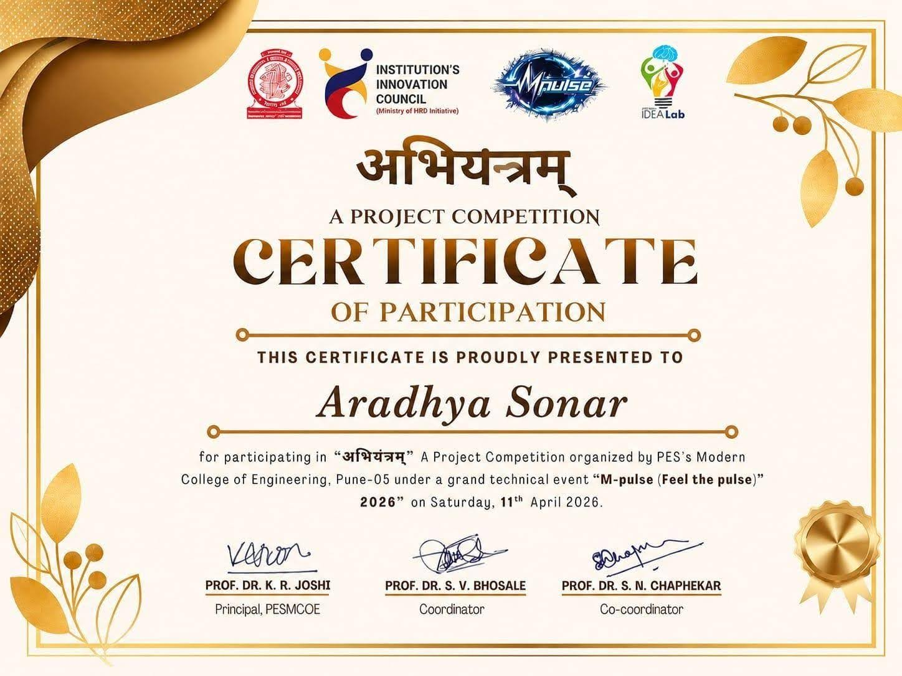

<div align="center">
  
  <br/>
  
  <h1>🌟 ARADHYA SONAR - AI Tracking & Reunion System 🌟</h1>
  
  <p>
    <strong>A State-of-the-Art Computer Vision & AI Platform for Tracking and Reconnecting Missing Individuals</strong>
  </p>
  
  [](https://github.com/sonararadhya)
  [](https://www.python.org/)
  [](https://www.djangoproject.com/)
  [](https://opencv.org/)
  
  <p align="center">
    <a href="#overview">Overview</a> • 
    <a href="#key-features">Key Features</a> • 
    <a href="#technology-stack">Tech Stack</a> • 
    <a href="#project-architecture">Architecture</a> • 
    <a href="#getting-started">Installation</a>
  </p>
</div>

---

## 🚀 Overview

Welcome to the **AI Tracking & Reunion System** by **Aradhya Sonar**. This powerful platform acts as an intelligent shield, leveraging cutting-edge AI and advanced computer vision algorithms to drastically accelerate the process of locating missing persons and returning them safely to their families.

By unifying real-time facial recognition, decentralized RTSP camera tracking, and a comprehensive centralized database, this system elevates modern security and law enforcement capabilities.

## ✨ Key Features

- **🧠 Advanced Facial Recognition**: Employs deep-learning ArcFace models to match faces with unparalleled accuracy, even in low-light or angled scenarios.
- **📍 Live RTSP Camera Tracking**: Connects to global or local surveillance streams to analyze live feeds autonomously.
- **🚨 Instant AI Alerts**: Triggers real-time notifications to administrators and officers upon detecting a positive match.
- **🛡️ Secure Command Center**: A Django-powered centralized dashboard for law enforcement to manage cases, view sightings, and coordinate operations.
- **⚡ Asynchronous Processing**: Utilizes Celery and Redis to handle intensive image processing operations natively in the background without dropping frames.
- **🌍 Geospatial Mapping**: Calculates nearby police stations instantly upon a positive sighting to dispatch aid seamlessly.

---

## 🛠 Technology Stack

The project fuses battle-tested frameworks with next-generation machine learning tools.

| Category | Technology |
| :--- | :--- |
| **Backend Framework** | Django 5.2, Python |
| **Asynchronous Engine** | Celery, Redis |
| **Database** | SQLite3 / Django ORM |
| **AI & Computer Vision** | OpenCV, InsightFace (RetinaFace & ArcFace) |
| **Data Analytics** | NumPy, Scikit-Learn |
| **Frontend** | HTML5, CSS3, JS, Bootstrap |

---

## 📂 Project Architecture

```text
Reunite-AI-Tracking-System/
├── Reunite/                 # Core Django Configuration & Settings
│   ├── settings.py          # Environment, Security, and App Configuration
│   ├── urls.py              # Root URL Routing
│   └── wsgi.py / asgi.py    # Server Gateway Interfaces
├── cases/                   # Missing Person AI Match Engine
│   ├── ai_processor.py      # Core InsightFace Model Logic
│   ├── models.py            # Case Data & Face Embeddings
│   ├── tasks.py             # Asynchronous Celery Processing
│   └── views.py             # Match Logic & Reporting
├── police/                  # Law Enforcement Dashboard
│   ├── models.py            # Officer Profiles
│   └── views.py             # Authentication & Case Handling
├── static/                  # Static Assets
│   ├── assets/              # Vendor Libraries (Bootstrap, AOS)
│   ├── img/                 # Application Imagery & Emblems
│   └── missing_persons/     # Pre-processed Headshots
├── templates/               # User Interface
│   ├── base.html            # Master Layout
│   └── index.html           # Command Center View
├── data/                    # Geospatial & Department Datasets
│   ├── locations.csv        
│   └── police_stations.csv  
├── docs/                    # Project Documentation & Diagrams
│   ├── images/              
│   ├── certificates/        # Achievements and Awards
│   └── Final_Year_Project_Report.pdf
├── scripts/                 # Standalone utilities
│   └── rtspCam.py           # 🎥 Live Surveillance Script
├── requirements.txt         # Dependencies
└── manage.py                # Django CLI
```

*(Note: Certain cache and virtual environment folders like `venv`, `__pycache__`, and `.git` are excluded for brevity.)*

---

## 💻 Getting Started

### 1. Environment Setup

Clone the repository and prepare your environment:
```bash
git clone https://github.com/sonararadhya/Reunite-AI-Tracking-System.git
cd Reunite-AI-Tracking-System
python -m venv venv

# Windows
venv\Scripts\activate
# Linux/Mac
source venv/bin/activate
```

### 2. Install Dependencies
```bash
pip install -r requirements.txt
```
*(Ensure you have system-level dependencies for OpenCV and Redis installed).*

### 3. Initialize Services

**Start Redis Server (Linux):**
```bash
sudo service redis-server start
```

**Run Database Migrations:**
```bash
python manage.py migrate
```

### 4. Boot up the Ecosystem
You will need multiple terminal windows to run the full suite:

**Terminal 1 (Web Dashboard):**
```bash
python manage.py runserver
```

**Terminal 2 (AI Background Worker):**
```bash
celery -A Reunite worker -l info -P solo
```

**Terminal 3 (Live Surveillance):**
```bash
python scripts/rtspCam.py
```

---

## 🏆 Certifications & Reports

- **Final Year Project Report:** [Read the comprehensive project report](./docs/Final_Year_Project_Report.pdf)
- **Project Certificate:** [View Certificate](./docs/certificates/PROJECT_CERTIFICATE.pdf)

**Project Competition Award:**


---

## 💡 Suggested Names for Future Evolution

If you are looking to rebrand or elevate this project, here are some powerful suggestions:
1. **OmniSight AI**
2. **Aegis Tracker**
3. **TraceNet Solutions**
4. **Sentinel Reunion**
5. **Project Nexus (By Aradhya)**

---

## 👤 Author & Creator

**Built and maintained by Aradhya Sonar.**

🔗 **GitHub:** [https://github.com/sonararadhya](https://github.com/sonararadhya)

> *"Empowering communities with artificial intelligence to bring loved ones home."*

---
<div align="center">
  <i>No unauthorized usage allowed. </i>
</div>
